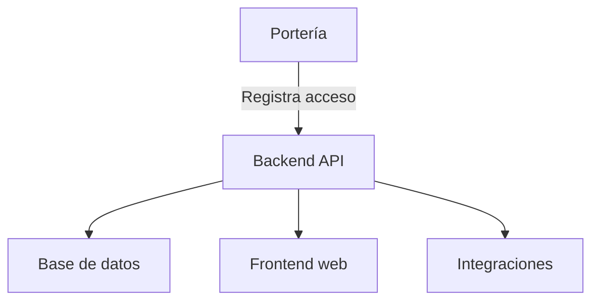

# Arquitectura del Sistema

El sistema HLVS está compuesto por los siguientes módulos principales:

- **Frontend web**: Interfaz para porteros y administradores.
- **Backend API**: Lógica de negocio y gestión de datos.
- **Base de datos**: Almacena registros de accesos y usuarios.
- **Integraciones**: Cámaras, sensores y notificaciones.

[Volver a la portada](index.md) 